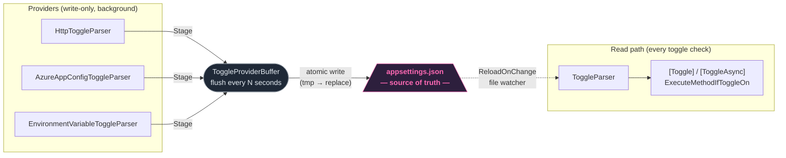

[](https://www.nuget.org/packages/FtrIO)
[](https://github.com/FtrOnOff/FtrIO/actions)
[](https://dotnet.microsoft.com)

# FtrIO

FtrIO == Feature On/Off

Gate method execution from config — no `if` statements, no wrapper classes. Decorate a method with `[Toggle]` and it becomes automatically gated by its own name.

## Why FtrIO?

- **Zero call-site noise.** `[Toggle]` is the only thing at every call site — all strategy wiring lives in one startup block, not spread across your codebase. A toggled method looks and calls exactly like a normal method — no `if (featureFlags.IsEnabled(...))`, no injected service, no wrapper at every call site. Remove the attribute and the method is back to normal.
- **appsettings.json as a read-through cache.** Other libraries make your app depend on an external flag service being online. FtrIO flips this: providers run in the background and write their state into `appsettings.json`; `ToggleParser` always reads from the file. If the remote source goes offline, the last known state is served automatically from disk — no fallback code, no circuit breaker, no stale-cache TTL to configure.
- **Escape hatch built in.** The same `appsettings.json` you already deploy works as a fully functional toggle store without any provider. Swap from a static file to Azure App Config (or back) without touching a single call site.

## The FtrIO ecosystem

- **[FtrIO](https://github.com/FtrOnOff/FtrIO)** — the core library. Weaves `[Toggle]` into your IL at compile time, reads state from `appsettings.json` at runtime, and optionally syncs from remote sources via the provider pipeline.
- **[FtrIO.Toaster](https://github.com/FtrOnOff/FtrIO.Toaster)** — a lightweight web UI for managing toggles live. Writes values through `ToggleProviderBuffer` so changes flush to `appsettings.json` and are picked up instantly via `ReloadOnChange` — no file editing, no restart. Available on [Docker Hub](https://hub.docker.com/repository/docker/thescottbot/ftrio/general) — deploy with a single `compose.yml`, no clone required.
- **[FtrIO.onetwo](https://github.com/FtrOnOff/FtrIO.onetwo)** — a .NET CLI audit tool. Scans your source tree for every toggle reference, cross-references against `appsettings.json`, and reports each toggle's state (ON / OFF / 20% / BLUE / MISSING) with file and line number.
- **[export-manifest-action](https://github.com/FtrOnOff/export-manifest-action)** — GitHub Action that scans source for `[Toggle]` usage and uploads a manifest of required toggle keys as a build artifact.
- **[release-check-action](https://github.com/FtrOnOff/release-check-action)** — GitHub Action that downloads the manifest and validates it against a target `appsettings.json` before deploying. Blocks the deploy if any keys are missing.

```
┌─────────────────────────────────────────────────────┐
│  Your code                                          │
│  [Toggle] public void SendWelcomeEmail() { ... }    │
└───────────────────┬─────────────────────────────────┘
                    │ compile-time weaving
                    ▼
┌─────────────────────────────────────────────────────┐
│  FtrIO core                                         │
│  gates method execution at runtime                  │
└───────────────────┬─────────────────────────────────┘
                    │ reads
                    ▼
┌─────────────────────────────────────────────────────┐
│  appsettings.json  — source of truth                │
└──────────┬──────────────────────────┬───────────────┘
           │ writes live              │ reads & audits
           ▼                          ▼
  FtrIO.Toaster                 FtrIO.onetwo
  (web UI — manage toggles)     (CLI — audit state)
```

## How it compares

|  | **FtrIO** | LaunchDarkly | Microsoft.FeatureManagement | Flagsmith |
|--|-----------|-------------|----------------------------|-----------|
| **Call-site syntax** | `[Toggle]` attribute, zero noise | SDK call at every site | `if (await _fm.IsEnabledAsync(...))` | SDK call at every site |
| **Works offline** | ✅ always (file-backed) | ❌ needs SDK fallback config | ✅ | ❌ needs SDK fallback config |
| **Compile-time validation** | ✅ Roslyn analyzer | ❌ | ❌ | ❌ |
| **Codebase audit / drift detection** | ✅ [FtrIO.onetwo](https://github.com/FtrOnOff/FtrIO.onetwo) CLI | ❌ | ❌ | ❌ |
| **CI/CD deploy gate** | ✅ blocks deploy if toggle keys missing from target config | ❌ | ❌ | ❌ |
| **Per-user targeting** | ✅ `UserTargetingStrategy` | ✅ | ✅ | ✅ |
| **Attribute-based rules** | ✅ `AttributeRuleStrategy` | ✅ | ✅ | ✅ |
| **A/B test assignment** | ✅ `ABTestStrategy` (deterministic) | ✅ | ⚠️ via Percentage filter | ✅ |
| **Management UI** | ✅ [Toaster](https://github.com/FtrOnOff/FtrIO.Toaster), self-hosted | ✅ SaaS dashboard | ❌ | ✅ SaaS dashboard |
| **Percentage rollout** | ✅ | ✅ | ✅ | ✅ |
| **Self-hosted / no vendor** | ✅ | ❌ paid SaaS | ✅ | ✅ (or SaaS) |
| **Cost** | Free, OSS | Paid SaaS | Free, OSS | Free tier / paid SaaS |

---

## Quick start

```bash
dotnet add package FtrIO
```

```json
{
  "FtrIO": { "ReloadOnChange": true },
  "Toggles": {
    "SendWelcomeEmail": true,
    "NewCheckoutFlow": false
  }
}
```

```csharp
using FtrIO;

[Toggle]
public void SendWelcomeEmail() { ... }

SendWelcomeEmail(); // runs only if "SendWelcomeEmail": true
```

---

## Dynamic providers

Providers let toggle state be driven by external sources at runtime while `appsettings.json` remains the single source of truth for all reads.



Providers push updates into `ToggleProviderBuffer`; the buffer flushes to `appsettings.json` on a configurable interval; `ToggleParser` reads from the file as normal. If a provider goes offline, the last flushed state persists automatically.

> **`ReloadOnChange: true` is mandatory when using providers** — without it `ToggleParser` reads the file once at startup and never sees buffer flushes.

> **Don't need automated sync?** [FtrIO.Toaster](https://github.com/FtrOnOff/FtrIO.Toaster) lets you change toggle values on demand via a UI — no provider pipeline required. It writes directly through `ToggleProviderBuffer` and your app picks up the change live.

> **[Full provider docs →](https://docs.ftrio.dev/#providers)** — HTTP, Azure App Config, env vars, buffer config, CompositeToggleParser

---

## Strategy-based decisions

`StrategyToggleParser` routes raw config values through a chain of `IToggleDecisionStrategy` implementations — percentage rollouts, blue-green slots, per-user targeting, attribute rules, A/B tests, and more. The recommended way to wire it up is the fluent `ToggleParserBuilder`:

```csharp
ToggleParserProvider.ConfigureBuilder(builder => builder
    .WithContextStrategies(contextAccessor)  // user targeting + attribute rules + A/B
    .WithPercentageRollout()
    .WithBlueGreen()
    .WithOverrides());  // reuses the accessor from WithContextStrategies
```

```json
{
  "FtrIO": { "BlueGreen": { "CurrentSlot": "blue", "KnownSlots": "blue,green" } },
  "Toggles": { "NewCheckout": "20%", "PaymentV2": "blue" }
}
```

Strategies run in the order you add them, and `BooleanStrategy` is always appended automatically so existing `true`/`false` values keep working.

<details>
<summary>Prefer explicit construction? Build the parser by hand</summary>

The builder is sugar over `StrategyToggleParser`'s constructors — you can always call them directly. Pass the `IFtrIOContextAccessor` as the first argument to enable per-user overrides. This is the exact equivalent of the chain above:

```csharp
ToggleParserProvider.Configure(new StrategyToggleParser(
    contextAccessor,  // enables per-user overrides (TogglesOverrides)
    new UserTargetingStrategy(contextAccessor),
    new AttributeRuleStrategy(contextAccessor),
    new ABTestStrategy(contextAccessor),
    new PercentageRolloutStrategy(),
    new BlueGreenStrategy()
));
```
</details>

> **[Full strategy docs →](https://docs.ftrio.dev/#strategies)** — percentage rollout, blue-green, per-user targeting, attribute-based rules, A/B test assignment, per-user overrides, fluent builder, custom `IToggleDecisionStrategy`

---

## Multi-environment support

Each server needs only its own `appsettings.json` — prod, staging, and dev are fully independent with no FtrIO configuration required. For single-machine overlays (`appsettings.{env}.json`) or remote config sources, see the docs.

> **[Multi-environment docs →](https://docs.ftrio.dev/#environments)**

---

## Reference

| Topic | Docs |
|-------|------|
| Async — `[ToggleAsync]`, `ExecuteMethodIfToggleOnAsync` | [docs/#async](https://docs.ftrio.dev/#async) |
| Hot-reload — `ReloadOnChange` | [docs/#hotreload](https://docs.ftrio.dev/#hotreload) |
| Multi-environment — overlays, remote sources | [docs/#environments](https://docs.ftrio.dev/#environments) |
| Dynamic providers — HTTP, Azure, env vars | [docs/#providers](https://docs.ftrio.dev/#providers) |
| Strategy decisions — percentage, blue-green, user targeting, attribute rules, A/B testing, overrides | [docs/#strategies](https://docs.ftrio.dev/#strategies) |
| Fluent configuration — `ToggleParserBuilder`, `ConfigureBuilder` | [docs/#strategies-builder](https://docs.ftrio.dev/#strategies-builder) |
| Compile-time validation — `FTRIO001` | [docs/#analyzer](https://docs.ftrio.dev/#analyzer) |
| Exceptions — `ToggleDoesNotExistException` etc. | [docs/#exceptions](https://docs.ftrio.dev/#exceptions) |
| Custom parser / Dependency Injection | [docs/#di](https://docs.ftrio.dev/#di) |
| Manual control — `ExecuteMethodIfToggleOn` | [docs](https://docs.ftrio.dev/) |
| Companion tooling — FtrIO.onetwo | [github.com/FtrOnOff/FtrIO.onetwo](https://github.com/FtrOnOff/FtrIO.onetwo) |
| Companion UI — FtrIO.Toaster | [github.com/FtrOnOff/FtrIO.Toaster](https://github.com/FtrOnOff/FtrIO.Toaster) |
| CI/CD — export-manifest-action | [github.com/FtrOnOff/export-manifest-action](https://github.com/FtrOnOff/export-manifest-action) |
| CI/CD — release-check-action | [github.com/FtrOnOff/release-check-action](https://github.com/FtrOnOff/release-check-action) |
| CI/CD — full pipeline docs | [docs/#cicd](https://docs.ftrio.dev/#cicd) |
| Version history — breaking changes, migration | [CHANGELOG.md](CHANGELOG.md) |
